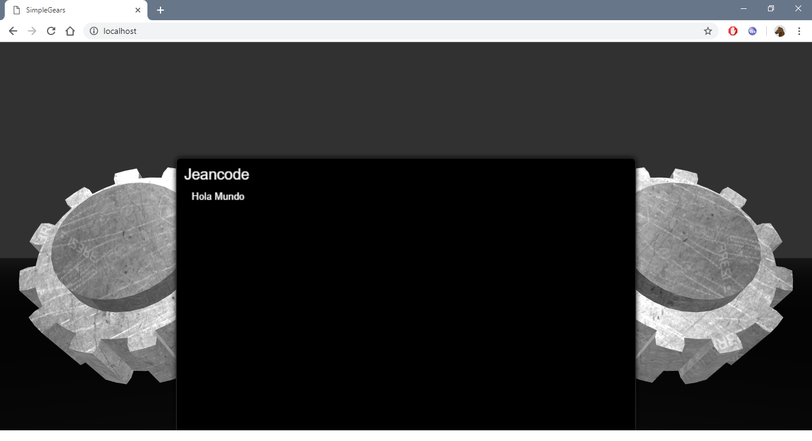
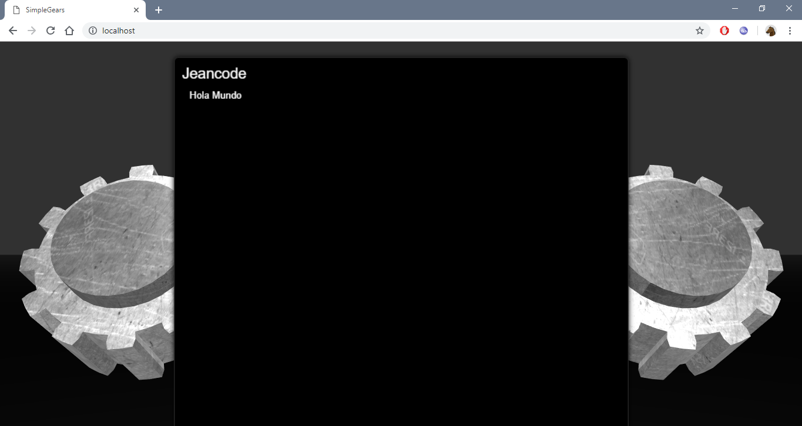

# Simple-Gears
Simple diseño 3d  css,javascript,webgl lamentablemente ese proyecto no puede ser ejecutado abriendo el archivo ya que requiere modelos 3d que se necesitan ser resueltos por un servidor, afortunadamente lo equipe con un pequeño servidor echo en nodejs asi que  procede a las instrucciones para  experimentar.

# Instrucciones
## 1.- instalar nodejs
##  2.- descragar el proyecto
##  3.- Entrar a la carpeta con cmd y ejecutar 
  > npm install
##  4.- Ejecutar el servidor
  > node server.js
##  4.- Abrir el Navegador y acceder a localhost
  
# Capturas

